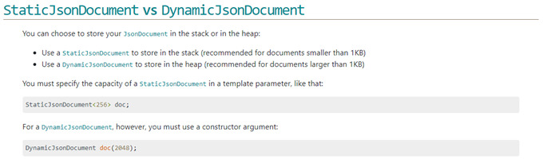
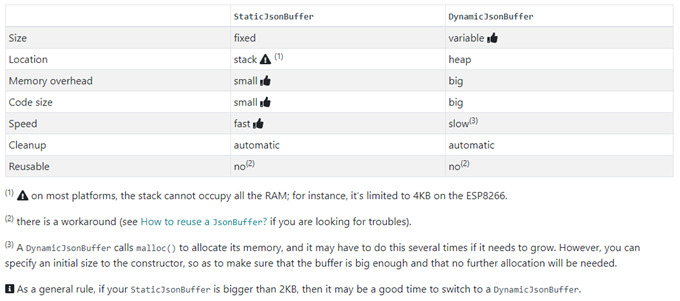
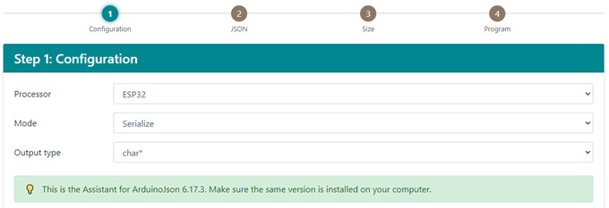
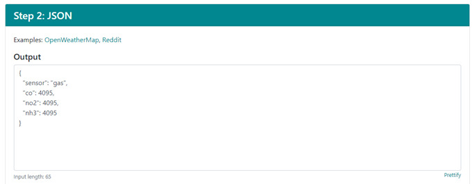
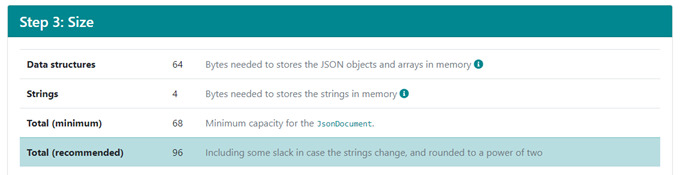
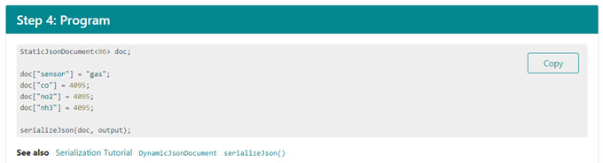
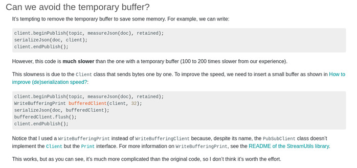
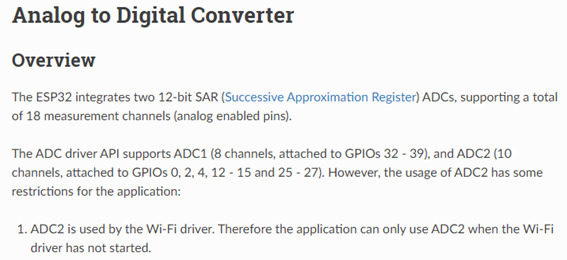
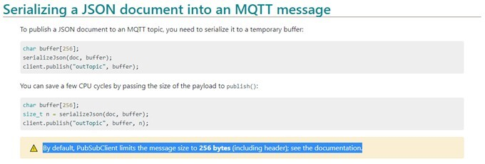

# Trabalhando com JSON no ESP32

Para enviar informações para o broker no formato JSON, a biblioteca [ArduinoJson](https://github.com/bblanchon/ArduinoJson) está sendo utilizada, mas é interessante prestar atenção em alguns pontos.

### Como enviar informações em JSON?
Essa biblioteca conta com funções para fazer a serialização e de serialização de objetos JSON.

Ela faz essa conversão utilizando um objeto do tipo DocumentJson, que pode ser criado utilizando alocação estática ou dinâmica de memória. Para arquivos menores de 1KBytes, se recomenda alocação estática, devido a sua maior performance. As figuras abaixo demonstrar algumas características de ambos os tipos de alocação.

A desvantagem de utilizar alocação estática é que devemos saber o tamanho do documento que queremos criar. Se pode calcular este valor utilizado este [link](https://arduinojson.org/v6/assistant/).

O assistente começa pedindo o tipo de processador (ESP32 no nosso caso), a operação (serialização para criar uma string Json) e o tipo de saída (queremos salvar essa string em uma variável do tipo string).

Depois o assistente pede um modelo da string Json que iremos enviar. Para esse exemplo se criou a saída de um sensor de gases, com um nome para identificação e os da leitura deste sensor para cada gás.

Então, o assistente nos fornecem um total mínimo e um total recomendado.

Por fim, o assistente ainda nos fornece como criar o documento estático e adicionar os valores requeridos no mesmo.

Para conseguirmos fazer a publicação de uma string Json utilizaremos um buffer em nosso código, que faz com que o controlador envie todas as informações de uma vez. Como a biblioteca realiza a conversão um byte de cada vez, não utilizar o buffer deixaria a operação de envio das mensagens desoptimizada, pois, a cada byte convertido, o cliente wifi iria fazer uma publicação, o que iria consumir muito tempo e deixar os canais ADC que são utilizados pelo wifi indisponíveis.

Um ponto importante de se lembrar é que o limite de transmissão de uma mensagem usando a biblioteca [PubSubClient](https://github.com/knolleary/pubsubclient) é limitado em 256bytes, então, o uso de memória pelo buffer não seria muito expressivo.

