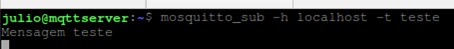
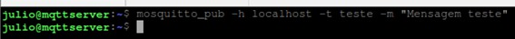
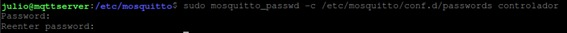
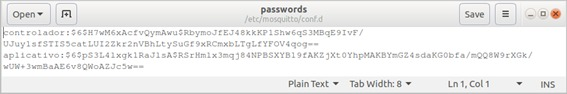
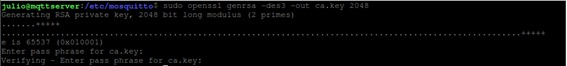
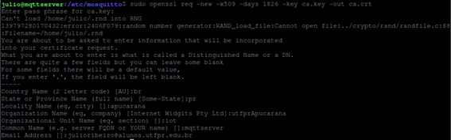
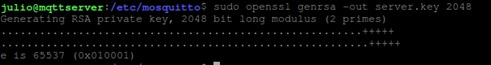
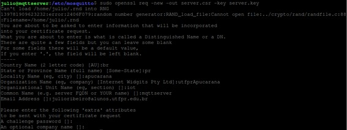
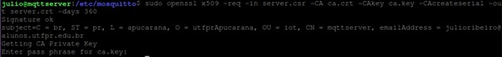

# Instalando e configurando o broker
Um broker é responsável por receber mensagens publicas em tópicos e as encaminhar para clientes inscritos nesses tópicos. O broker utilizado neste projeto foi o Mosquitto. Sua documentação pode ser encontrada [aqui](https://mosquitto.org/documentation/).

### Instalando o Mosquitto

Para este projeto, o broker foi criado em um Raspberry Pi, que usa o Debian como base. Sabendo disso, **podemos instalar o broker via terminal (em sistemas com base no Debian) utilizando so seguintes comandos:**

    sudo apt-get update
    sudo apt-get install mosquitto
    sudo apt-get install mosquitto-clients

Em outras distribuições, instruções para a instalação podem ser acessadas [aqui](https://mosquitto.org/download/).

Podemos testar o sucesso da instalação nos inscrevendo em um tópico utilizando uma janela do terminal e fazendo uma publicação neste tópico em outra janela do terminal. Se a mensagem aparecer na janela em que foi feita a inscrição, a instalação foi realizada com sucesso.

    mosquitto_sub -t topico/de/teste
    mosquitto_pub -t topico/de/teste -m "Mensagem de Teste"

Por padrão, o broker é instalado no diretório */etc/mosquitto* e, neste diretório, podemos encontrar outras 3 pastas e um arquivo. As 3 pastas são: *ca_certificates*, *certs* e *conf.d*. As duas primeiras são responsáveis por armazenar os certificados para gerarmos conexões seguras com criptografia e a terceira guarda os arquivos de configuração do usuário. Existe também um arquivo chamado *mosquitto.conf*, que contem algumas configurações padrões do broker. Não iremos modificar esse arquivo, e criaremos todos os arquivos de configuração na pasta *conf.d*.

Para colocarmos camadas de segurança no broker, precisamos configurar autentificação, permissões de leitura e escrita nos tópicos que serão utilizados e encriptar as comunicações. Iremos começar adicionando autentificação.

### Adicionando autenticação
No broker mosquitto, os usuários e senhas são cadastrados em arquivos que podem ser gerados da seguinte forma:

    sudo mosquitto_passwd -c /etc/mosquitto/conf.d/passwords nome_do_usuario

Após executado o comando, será pedido uma senha e a confirmação dessa senha. Um novo arquivo de senhas então será gerado na pasta *conf.d*, contendo esse usuário que acabamos de cadastrar.

O arquivo de senhas gera o nome do usuário e a senha criptografada, desta maneira:

O prefixo *-c* indica que um novo arquivo de senhas será criado. Se quisermos adicionar um novo usuário em um arquivo de senhas existente, basta omitir este prefixo. Para excluir um usuário do arquivo de senhas, basta utilizarmos o prefixo -D, da seguinte forma:

    sudo mosquitto_passwd -D /etc/mosquitto/conf.d/passwords nome_do_usuario

A documentação completa do comando mosquitto_passwd pode ser encontrada [aqui](https://mosquitto.org/man/mosquitto_passwd-1.html).

Para dizermos ao broker que queremos que apenas usuários cadastrados no broker possam acessa-lo, devemos criar um arquivo de configuração e adicionar algumas linhas nele. O arquivo pode ser gerado da seguinte forma:

    sudo nano /etc/mosquitto/conf.d/mosquitto.conf

Após executado esse comando, uma janela do editor nano será aberta, e então, podemos adicionar as seguintes linhas:

	allow_anonymous false
	password_file /etc/mosquitto/conf.d/passwords

A primeira linha proíbe que usuários que tentem logar sem usuário e senha tenham acesso ao broker e a segunda passa o caminho do arquivo de senhas para informar o broker quem são os usuários cadastrados.

Para que as modificações possam ser efetuadas, precisamos reiniciar o broker:

	sudo systemctl restart mosquitto

Podemos testar fazendo uma inscrição e publicação como antes, mas agora passando o usuário e senha cadastrado.

    mosquitto_sub -u usuario -P senha -t topico/de/teste
    mosquitto_pub -u usuario -P senha -t topico/de/teste -m "Mensagem de Teste"

### Criando permissões de leitura e escrita nos tópicos
Podemos configurar o tipo de acesso que cada usuário terá em um tópico. Para isso, precisamos criar um arquivo ACL (Access Control List). Este arquivo pode ser gerado com o seguinte comando:

	sudo nano /etc/mosquitto/conf.d/aclfile.txt

Uma janela do editor de texto nano ira abrir e podemos configurar o arquivo ACL da maneira que quisermos. Para informações de como configurar este arquivo, checar o **arquivo de como configurar permissões nos tópicos**.

Para informarmos ao broker a localização deste arquivo, devemos adicionar o seguinte comando ao arquivo de configurações (*sudo nano /etc/mosquitto/conf.d/mosquitto.conf*):

	acl_file /etc/mosquitto/conf.d/aclfile.txt

Lembre-se também de reiniciar o broker para que as alterações sejam feitas.

### Encriptando as trocas de mensagens
O mosquito usa o protocolo TLS para troca de mensagens com criptografia. Para gerar e assinar os certificados, será utilizado o software *openssl*. Por padrão este programa já vem instalado com o sistema operacional utilizado, mas, se necessário, o link para encontrar guias de instalação e documentação oficial deste software pode ser acessado [aqui](https://www.openssl.org/).

**Os passos a seguir irão gerar os certificados necessários:**

Primeiro, precisamos gerar uma chave privada de criptografia e gerar o certificado para a autoridade certificadora, que neste caso será nós mesmos:

	sudo openssl genrsa -des3 -out ca.key 2048
	sudo openssl req -new -x509 -days 1826 -key ca.key -out ca.crt

O terminal irá nos pedir uma senha para a chave privada e algumas informações para preencher o certificado. É importante colocar o IP da máquina em que o broker está instalado no campo *Common Name*. Se pode também utilizar o domínio deste servidor (se existir).

Após isso, devemos gerar uma chave para o servidor e o certificado para o servidor. Novamente colocar o IP do servidor no campo *Common Name* quando requisitado.

	sudo openssl genrsa -out server.key 2048
	sudo openssl req -new -out server.csr -key server.key

Por fim, se assina e valida o certificado do servidor com a chave da autoridade certificadora:

	sudo openssl x509 -req -in server.csr -CA ca.crt -CAkey ca.key -CAcreateserial -out server.crt -days 360

Agora, copiamos os seguintes arquivos para a pasta do broker:

 - *ca.crt* vai para a parta *etc/mosquitto/ca_certificates*
 - *server.crt* e server.key vai para a pasta *etc/mosquitto/certs*

Para copiar os arquivos basta utilizar o comando

	sudo mv caminho_atual_do_arquivo caminho_de_destino

Tentar mover os arquivos com o mouse irá gerar erros de permissão.

Por fim, adicionamos as seguintes linhas no arquivo de configuração (*sudo nano /etc/mosquitto/conf.d/mosquitto.conf*):

	listener 8883
	certfile /etc/mosquitto/certs/server.crt
	keyfile /etc/mosquitto/certs/server.key
	cafile /etc/mosquitto/ca_certificates/ca.crt

O primeiro comando faz com o que o broker utilize a porta 8883 para troca de mensagens (porta segura) e as últimas 3 linhas indicam o caminho dos certificados e da chave geradas.

Então, se reinicia o broker e se pode testar a troca de mensagens com uma publicação e uma inscrição no terminal:

	mosquitto_sub -h ip_da_maquina -p 8883 -u usuario -P senha -t topico/de/teste --cafile /etc/mosquitto/ca_certificates/ca.crt
	mosquitto_pub -h ip_da_maquina -p 8883 -u usuario -P senha -t topico/de/teste -m "teste" --cafile /etc/mosquitto/ca_certificates/ca.crt

Se tudo foi configurado corretamento, nenhum erro será retornado e a mensagem poderá ser vista na aba do terminal que executou o comando de inscrição.

Mais informações sobre o arquivo de configuração podem ser acessadas [aqui](https://mosquitto.org/man/mosquitto-conf-5.html).
Mais informações sobre a adição de TLS no broker pode ser encontrado nos seguintes links:

 - [Documentação oficial](https://mosquitto.org/man/mosquitto-tls-7.html) (possui um link para um vídeo prático de como adicionar TLS no broker);
 - [Tutorial em portugues](https://www.youtube.com/watch?v=-ENhAGqmMvc) (configurações realizadas no Windows mas os passos do *openssl* são idênticos no Linux);