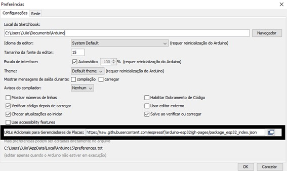
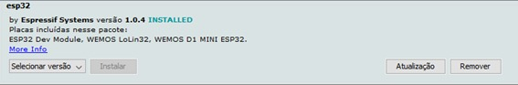
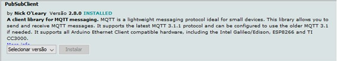
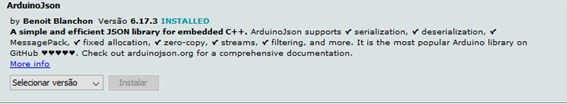

# Instalando e configurando a IDE do Arduino
Podemos utilizar a IDE do Arduino para criar e editar os scrips do microcontrolador ESP-32. É necessário uma pequena configuração inicial para que esta IDE possa ser utilizada.

### Instalando a IDE do Arduino
O tutorial de instalação pode ser encontrado [aqui](https://www.arduino.cc/en/Guide), basta seguir o correto para o seu sistema operacional.

### Configurando a IDE

**Editar as configurações:**
Depois de realizada a instalação, iremos abrir a IDE, navegar no menu *Arquivo > Preferencias* e na janela iremos encontrar um espaço para adicionarmos URLs de placas adicionais. Iremos utilizar o seguinte link (utilizado para baixar a biblioteca de desenvolvimento para o ESP-32): https://raw.githubusercontent.com/espressif/arduino-esp32/gh-pages/package_esp32_index.json

**Fazer Download  da Biblioteca:**
Após adicionado esse link, iremos aplicar as modificações e fechar a janela.
Então, pomos navegar para *Ferramentas > Placas > Gerenciamento de Placas...*, pesquisar por ESP-32 e fazer o download da biblioteca *"ESP32 by Espressif Systems"*.

**Selecionar a Placa Correta:**
Depois de baixar a biblioteca, podemos fechar a janela do Gerenciador de Placas e navegar para *Ferramentas > Placas > ESP32 Arduino* e selecionar a placa correta. Neste projeto, a placa que está sendo utilizada é a **Heltec WiFi LoRa 32**.

**Selecionar a Porta COM Correta:**
Primeiramente precisarmos saber qual porta COM o microcontrolador está utilizando. No Windows, podemos verificar esse informação no *Gerenciador de Dispositivos*, no Linux, pode ser utilizado o seguinte comando no terminal:

	ls /dev/tty*

Se este código for executado 2 vezes, uma vez sem a placa conectada ao USB e a segunda vez com a placa conectada, a nova placa que aparecer na segunda execução do comando será a utilizada pelo microcontrolador.
Por fim, selecionamos a porta COM correta em *Ferramentas > Porta*.

### Outras Bibliotecas Utilizadas
O Arduino consegue baixar bibliotecas adicionais na aba *Ferramentas > Gerenciar Bibliotecas*. As ferramentas que foram utilizadas neste projeto foram:

 - [PubSubClient  by Nick O’Leary](https://github.com/knolleary/pubsubclient): Esta biblioteca contém as funções necessárias para conexão com o broker. É com ela também que se encontram as funções para publicar e subscrever em tópicos do broker. **Versão utilizada: 2.8.0**. A documentação pode ser encontrada [aqui](https://pubsubclient.knolleary.net/api);

 - [ArduinoJson  by Benoit Blanchon](https://github.com/bblanchon/ArduinoJson): Esta biblioteca torna possível gerar as mensagens que serão publicadas no formato Json. **Versão utilizada: 6.17.3**. A documentação pode ser encontrada [aqui](https://arduinojson.org/v6/doc/).

### Possíveis Problemas
Foram encontrados problemas em fazer conexões ao broker utilizando a versão 1.0.6 da biblioteca do ESP-32. Se ocorrerem problemas de conexão tentar usar a versão 1.0.4.

Se o sistema operacional que estiver sendo executado for o Ubuntu ou qualquer outro com base que o usa como base, podem haver problemas de permissão ao tentar executar o código no microcontrolador. Se o código não funcionar, tente rodar esse comando no terminal (irá mudar as permissões de acesso da porta COM):

	sudo chmod a+rw /dev/sua_porta_COM

